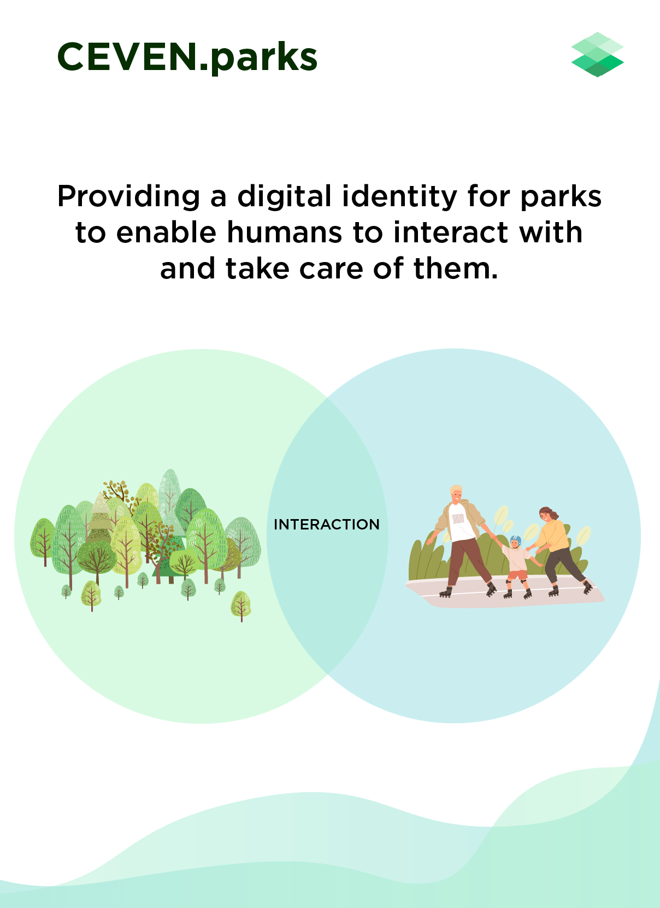

# CEVEN.parks - A CEVEN.protect Project

## Project Overview

| Project name        | CEVEN.parks                                                     |
| :------------------ | ------------------------------------------------------------  |
| Product demo        | https://ceven-project-soveiring.web.app/                                   |
| Blog post           | TBA                                                           |
| Dissemination level | Public                                                        |
| Version             | 0.1                                                           |
| Text license        | This work is licensed under a Creative Commons Attribution-ShareAlike 4.0 International License |
| Software license    | GNU AFFERO GENERAL PUBLIC LICENSE 3.0                         |
| Status              | Work in progress                                              |

## Team 

Team members: 
-   Lisa Broekhuizen, Geo-Intelligence
-   Sham Gir, Front End EOSJS Developer
-   Jessica Immelman, Geo-Intelligence
-   Abhijit Roy, EOSIO Developer
-   Vivien Tillett, Design
-   Yannick Zehnder, Team Lead 

## Repository Guide

For detailed technical information please visit https://github.com/CEVEN-DGT/snihack2021/tree/contracts/contracts/cevenparksio 

## Credits

Thanks and shoutouts to:

- Sovereign Nature Inintiative (https://sovereignnature.com/) 
- Special thanks to Alessandro Mazzi and Seth Bockley for making this hackathon a very smooth experience!

------
